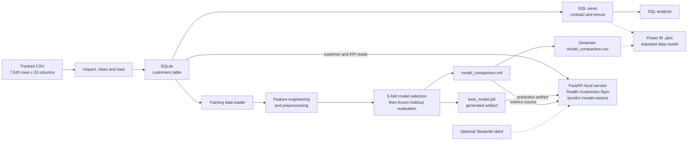

# Customer Churn Prediction & Business Intelligence Platform

A local end-to-end workflow that cleans a telecom customer dataset, evaluates churn classifiers, serves customer KPIs and predictions through FastAPI, and supports business-intelligence reporting.

## The problem

The capstone addressed an analytics workflow problem: turning a customer-level telecom churn snapshot into reusable churn summaries and a testable risk-prediction API. The input is the IBM Telco sample in this repository (7,043 rows and 33 columns); it is a synthetic product sample, not live customer data. The project demonstrates analysis and integration work—it does not measure whether a retention intervention reduced churn.

Dataset identity, source history, checksum, and the unresolved redistribution-rights question are documented in [`docs/data_provenance.md`](docs/data_provenance.md).

## What I built

This was a mentored team capstone with seven named team members; implementation ownership varied by component. The repository contains these implemented components:

- A Python ETL pipeline that inspects and cleans the CSV, loads it into SQLite, and creates reusable SQL views.
- A SQL schema with data constraints, analysis queries, and views for churn by contract and tenure.
- A model-training and evaluation pipeline with feature engineering, preprocessing, model comparison, and a persisted prediction artifact.
- A FastAPI service for health, paginated customer records, whole-table KPIs, predictions, and model metrics.
- A five-page Power BI report (`dashboard/churn_dashboard.pbix`), screenshots, and a written business report.
- Tests, a pinned Python dependency set, and a GitHub Actions test workflow.

An optional Streamlit API client and Docker/Compose definitions are also in the repository; neither path was verified in the release audit. Team roles and ownership boundaries are listed in [`CONTRIBUTORS.md`](CONTRIBUTORS.md). This is not a claim of sole authorship; my specific work is described in [My contribution](#my-contribution).

## Architecture



The solid arrows represent the verified local ETL, training, database, and API paths. Dashed arrows show the documented Power BI import/ODBC and optional Streamlit client paths; they were not independently verified. Nothing in this diagram is deployed as a hosted service.

## How it works

1. **Prepare the data.** `etl/` reads the tracked CSV, normalizes and cleans fields, then loads 7,043 records into the `customers` table. `database/init_views.py` creates the contract and tenure views.
2. **Train and evaluate.** `training/evaluate_models.py` reads from SQLite, builds features, compares candidate classifiers using the protocol below, saves `models/best_model.pkl`, and writes `evaluation/model_comparison.md`. `scripts/generate_model_comparison_csv.py` exports the report table for the dashboard.
3. **Serve locally.** FastAPI reads customer data and whole-dataset KPIs from SQLite, loads the model for `/predict`, and reads the metrics report for `/model-metrics`. `/health` is unauthenticated; the other four endpoints require `X-API-Key`. Customer results are paginated (100 rows by default); KPIs use a whole-table SQL aggregate.
4. **Review the report.** The Power BI file contains five report pages. Its committed data model is imported; the documented local ODBC/Power Query refresh procedure was not re-run, so a live dashboard connection is not claimed. The optional Streamlit script is an API client, not a separate prediction service.

## ML / AI methodology

- **Task and target:** binary classification of `churn_value` (0/1) from a static customer snapshot.
- **Features:** customer ID, geography, `churn_label`, and outcome-derived `churn_score`, `churn_reason`, and `cltv` are excluded. The pipeline adds `TenureBucket`, `TotalServicesCount`, and `AvgMonthlySpend`; categorical columns are one-hot encoded and numeric columns passed through.
- **Candidates:** Logistic Regression (`max_iter=1000`), Decision Tree, Random Forest, XGBoost, and LightGBM. Other than the Logistic Regression iteration cap, the classifiers use default hyperparameters; no hyperparameter search was performed.
- **Baseline:** `DummyClassifier(strategy="prior")`, reported for reference and not eligible for model selection.
- **Validation:** a stratified 80/20 split with `random_state=42`; five-fold stratified cross-validation on the 80% training portion selects the winner by mean ROC AUC. Preprocessing is fit inside each fold. The selected model is refit on the full training portion, then scored once on the untouched 20% holdout (1,409 rows). The baseline is evaluated on the same holdout.
- **Leakage control:** an earlier integration run exposed `churn_score` as an outcome-derived input. It was removed before the current evaluation; leakage-affected metrics are not presented as valid results.

The current protocol and complete metrics are in [`evaluation/model_comparison.md`](evaluation/model_comparison.md). The cross-validation ROC AUC means (standard deviation across five folds) were: Logistic Regression **0.8591 ± 0.0142**; LightGBM 0.8518 ± 0.0076; Random Forest 0.8396 ± 0.0098; XGBoost 0.8387 ± 0.0079; Decision Tree 0.6733 ± 0.0227. The prior baseline scored 0.5000.

## Engineering

- **Reproducible environment:** CPython 3.11.2 is recorded in `.python-version`; direct dependencies are pinned in `requirements.txt` and constrained by `requirements.lock.txt`. The release audit rebuilt the environment and reproduced the committed evaluation report byte-for-byte.
- **Validation:** ETL cleaning rules, SQLite `CHECK` constraints, Pydantic request validation, and regression tests cover important data and API boundaries.
- **API security and errors:** `X-API-Key` protects the four non-health endpoints; invalid requests return validation errors. The application uses Python's standard logging. This is a shared API key, not user-level authentication.
- **Tests:** with generated database/model artifacts present, the verified suite result was **151 passed, 0 failed, 0 skipped**. On a fresh checkout, **68 passed and 83 skipped** because artifact-dependent tests have nothing to exercise until the pipeline runs.
- **CI:** `.github/workflows/ci.yml` builds the artifacts, checks the pinned dependency closure, and requires a zero-skip test run. GitHub Actions has not executed a job for this repository: the account was blocked by a billing issue before any job steps started. The pinned install, artifact build, full suite, and Bash smoke checks were verified locally during the release audit. The PowerShell smoke-test script itself remains unexecuted.
- **Secrets:** `.env` and local variants are ignored by Git; only `.env.example` with a placeholder key is tracked. No `.env` file is committed.

## Results

On the untouched holdout, the selected Logistic Regression model produced:

| Holdout result | Accuracy | Precision | Recall | ROC AUC |
|---|---:|---:|---:|---:|
| Logistic Regression | 0.7991 | 0.6435 | 0.5455 | **0.8496** |
| Prior baseline | 0.7346 | 0.0000 | 0.0000 | 0.5000 |

The Logistic Regression confusion matrix was `[[922, 113], [170, 204]]` (true negatives, false positives, false negatives, true positives). It missed 170 of 374 churners in the holdout, so its recall is a material limitation—not a claim of reliable customer-level intervention.

The dataset contains 1,869 churned customers out of 7,043 (**26.54%**). The `/kpis` endpoint's whole-table aggregate matches an independent SQL check. These are dataset and evaluation results only; no deployed usage or business impact was measured.

## Demo

There is **no live deployment and no recorded video**. The local demo path is the FastAPI service and the Power BI file; the latter requires Power BI Desktop to inspect.

**Current screenshot:** the Churn Drivers page was checked against the live SQL views in the 6 October 2026 release audit. Click the image to open the full-size capture.

<a href="dashboard/screenshots/churn_drivers.jpg"></a>

*The “Avg Churn Score” card shows an outcome-derived source-data field, not a model input or a validated prediction score. The other screenshots are archived captures; `model_predictions.jpg` shows the superseded single-split comparison and is historical.*

- [Open the Power BI report](dashboard/churn_dashboard.pbix)
- [Business report](dashboard/business_report.md)
- Other captures: [Executive Overview](dashboard/screenshots/executive_overview.jpg) · [Customer Demographics](dashboard/screenshots/customer_demographics.jpg) · [Revenue Impact](dashboard/screenshots/revenue_impact.jpg) · [Model Predictions — historical](dashboard/screenshots/model_predictions.jpg)

## Run locally

The end-to-end instructions below were verified on **Linux with CPython 3.11.2**. Other operating systems and Python versions were not independently verified. For endpoint smoke checks, install `curl` and `jq`.

```bash
git clone https://github.com/Tessa-Saumu/Customer-Churn-ML-Portfolio.git
cd Customer-Churn-ML-Portfolio

python3.11 -m venv .venv
source .venv/bin/activate
python -m pip install --upgrade pip wheel
python -m pip install -r requirements.txt

cp .env.example .env
# Edit .env and set API_KEY=local-dev-key before starting the API.

python database/init_db.py
python etl/load_to_db.py
python database/init_views.py
python training/evaluate_models.py
python scripts/generate_model_comparison_csv.py
python -m pytest -q
```

Start the API in one terminal from the repository root:

```bash
python -m uvicorn app.main:app --host 127.0.0.1 --port 8000
```

In a second terminal, run the Bash acceptance checks using the same key as `.env`:

```bash
API_KEY=local-dev-key ./scripts/verify_endpoints.sh
```

The recorded run returned **29 passed, 0 failed, 0 skipped**. The script defaults to `http://localhost:8000` and exits nonzero for a failed or un-runnable check. The PowerShell counterpart is present but has not been executed. Training creates the gitignored database and model artifact; running it in the pinned environment regenerates the committed evaluation report byte-for-byte.

## Repository structure

- `data/raw/` — tracked input CSV; provenance and rights status in `docs/data_provenance.md`.
- `etl/`, `database/`, `sql/` — cleaning, SQLite initialization, schema, views, and analysis queries.
- `training/`, `predict.py`, `evaluation/` — feature preparation, evaluation pipeline, current report, and historical comparison archive.
- `app/` — FastAPI routes, schemas, services, authentication, and repository access.
- `tests/` — API, ETL, model, KPI, reproducibility, and SQL-view tests.
- `dashboard/` — Power BI file, screenshots, and business report.
- `docs/`, `scripts/` — provenance, reproduction and QA records, CSV export, and endpoint checks.

`database/churn.db` and `models/best_model.pkl` are generated locally and intentionally not tracked.

## Limitations

- The source is a static sample with no time index. A single seeded holdout does not establish performance on future periods, other carriers, or other populations.
- Holdout recall is 54.55%; no threshold tuning, class weighting, calibration, or hyperparameter search was performed. Logistic Regression does not converge within its configured 1,000 iterations on the current features.
- The engineered tenure bucket has an open upper edge: inputs above 72 months map to a missing bucket, while the prediction endpoint currently still returns a result.
- The dataset's redistribution permission is unconfirmed. Its provenance record explains what is known and the repository's retention decision.
- The API loads its model at import time, and `/model-metrics` parses a human-readable Markdown report. There is no TLS, rate limiting, request monitoring, or per-user identity.
- GitHub Actions has no completed run because of the account billing lock. Docker images/Compose and the Streamlit client are present but unverified; Power BI refresh behavior was not re-tested.

## What I would improve next

1. Evaluate on a new, appropriately licensed dataset with a time dimension; address the Logistic Regression convergence warning and assess calibration and churn-threshold trade-offs.
2. Make serving more resilient by loading the model lazily and replacing Markdown parsing with a versioned structured metrics artifact; add production-grade identity, transport security, and monitoring only if deployment becomes a goal.
3. Resolve the dataset redistribution question and establish a permitted, reproducible input path; then obtain an actual GitHub Actions run rather than relying solely on local verification.

## My contribution

I am Theresia Saumu, the team lead and technical reviewer. My documented implementation work includes:

- **Real model/API integration** in [merged PR #27](https://github.com/Tessa-Saumu/Customer-Churn-Prediction-BI-Platform/pull/27): connected the API to the trained model and added the API-to-training field adapter and artifact-path configuration.
- **Automated tests** in [merged PR #29](https://github.com/Tessa-Saumu/Customer-Churn-Prediction-BI-Platform/pull/29), [#30](https://github.com/Tessa-Saumu/Customer-Churn-Prediction-BI-Platform/pull/30), and [#31](https://github.com/Tessa-Saumu/Customer-Churn-Prediction-BI-Platform/pull/31), covering ETL, API, and model behavior; I also contributed the SQL-view test guard and final integration/QA documentation.
- **Technical review and integration coordination** across the team's work.

ETL/database/SQL, initial model training, the API scaffold, and the Power BI report had other owners. Some repository/auth scaffolding, pagination, and stretch-goal infrastructure were provided by mentor Adeyeri Michael; I do not claim those as my authored work. See [`CONTRIBUTORS.md`](CONTRIBUTORS.md) for team attribution and [`FLAGSHIP_RELEASE_AUDIT.md`](FLAGSHIP_RELEASE_AUDIT.md) for the independent verification record.
